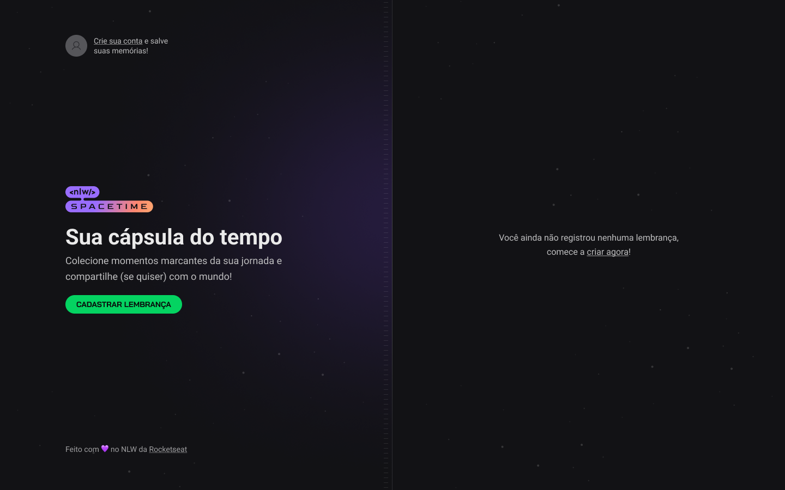
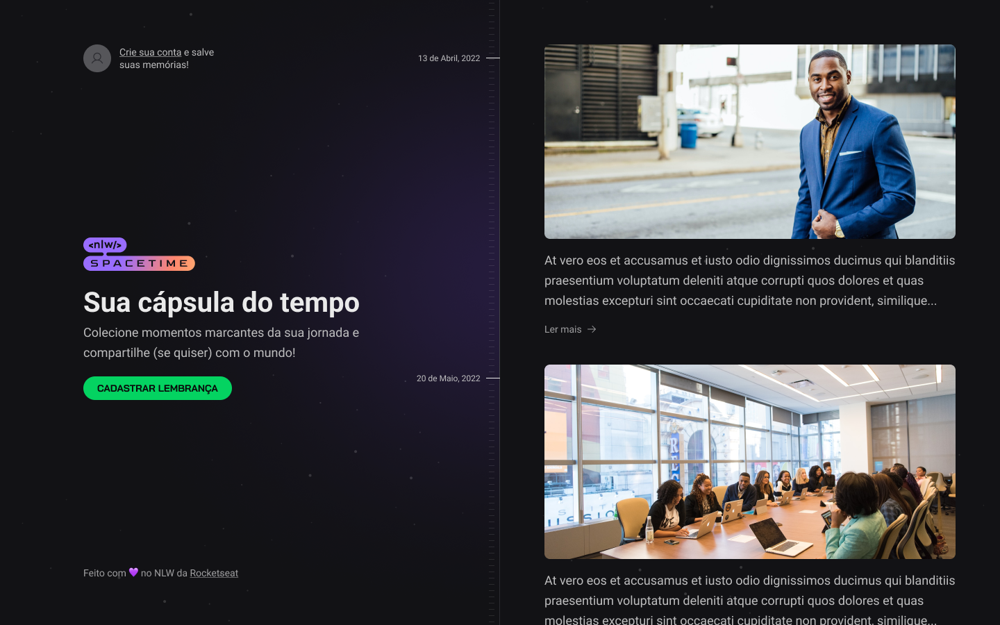
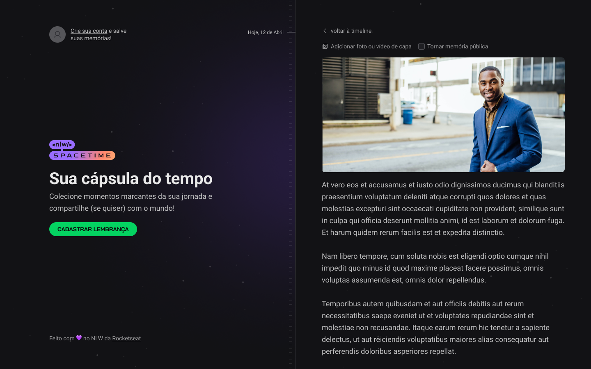
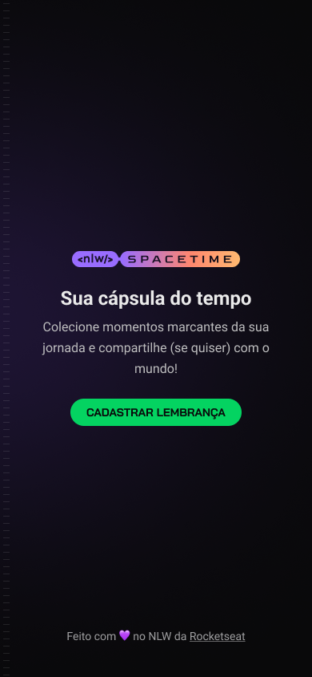
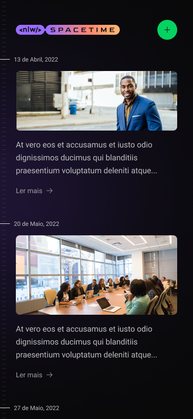
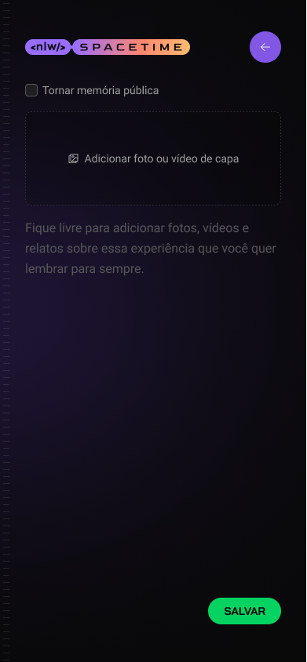

# _Time Capsule_

O Time Capsule é uma aplicação web e mobile que permite aos usuários criar cápsulas do tempo virtuais para armazenar memórias, mensagens, fotos e vídeos, com a possibilidade de compartilhar essas cápsulas com outras pessoas. É uma forma única de preservar momentos especiais e compartilhá-los com o mundo.

## **Tecnologias utilizadas**

- **React**: Uma biblioteca JavaScript de código aberto para construir interfaces de usuário. O React é utilizado para criar a interface do usuário do aplicativo web Time Capsule.
- **React Native**: Um framework JavaScript para criar aplicativos móveis nativos. O React Native é utilizado para desenvolver a versão movbile do aplicativo Time Capsule.
- **Next.js**: Um framework React de código aberto que permite a criação de aplicativos web com renderização no lado do servidor.

- **TypeScript**: Uma linguagem de programação de código aberto que estende o JavaScript adicionando tipagem estática opcional.
- **Tailwind CSS**: Uma biblioteca de classes CSS utilitárias para estilização de interfaces de usuário.
- **Fastify**: Um framework web rápido e eficiente para Node.js. O Fastify é utilizado no backend, fornecendo rotas e manipulação de requisições HTTP.
- **SQLite**: Um banco de dados relacional leve e incorporado. O SQLite é utilizado para armazenar os dados de forma eficiente e escalável.
- **Prisma**: Uma ferramenta de mapeamento de dados e camada de acesso ao banco de dados para Node.js. O Prisma é utilizado para simplificar a interação com o banco de dados SQLite.
- **Expo**: Uma plataforma para desenvolvimento que permite criar aplicativos usando React Native sem a necessidade de configurações complexas.

## **Layout**

### **Web**

**Home**
</img>

**Memories**
</img>

**Create Memory**
</img>

### **Mobile**

**Home**
</img>

**Memories**

</img>

**Create Memory**

</img>

### **Créditos**

Este projeto foi desenvolvido por [Breno Moreira](https://www.linkedin.com/in/brenomorp/) no NLW Spacetime da [Rocketseat](https://www.rocketseat.com.br/).

Contribuições são bem-vindas! Se você tiver sugestões, melhorias ou correções, fique à vontade para abrir uma issue ou enviar um pull request.
